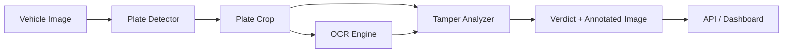

# System Architecture

## Overview

The system follows a modular pipeline architecture separating detection, recognition, analysis, and presentation layers.

## Components

### 1. Input Layer
- Accepts JPEG/PNG/WebP vehicle images via REST API or Streamlit upload
- Stores uploads in `uploads/` for traceability

### 2. Plate Detection Module (`ml/plate_detector.py`)
- Converts image to grayscale
- Applies bilateral filtering and Canny edge detection
- Filters contours by aspect ratio (2.0–6.5) and area
- Returns highest-confidence bounding box

### 3. OCR Module (`ml/ocr_engine.py`)
- Preprocesses plate crop (resize, denoise, Otsu threshold)
- Runs EasyOCR for character extraction
- Validates against Indian format: `^[A-Z]{2}[0-9]{1,2}[A-Z]{1,3}[0-9]{4}$`

### 4. Tampering Analysis Module (`ml/tampering_detector.py`)
- Computes forensic signals from plate crop
- Runs TamperCNN for learned classification
- Produces weighted tamper score and verdict

### 5. Output Layer
- Annotated image with bounding box and label
- JSON response with scores, signals, and metadata
- Streamlit visualization

## Data Flow Diagram

## Deployment Model

| Component | Port | Protocol |
|-----------|------|----------|
| FastAPI | 8000 | HTTP REST |
| Streamlit | 8501 | HTTP |

Both can run on a single machine. For production, containerize with Docker and deploy behind nginx.
